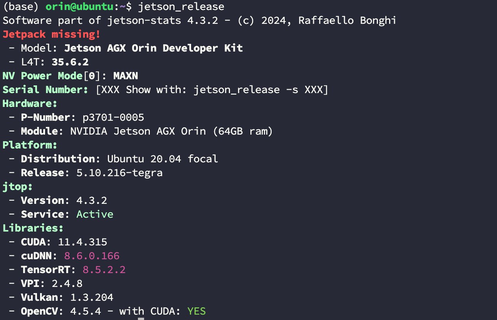
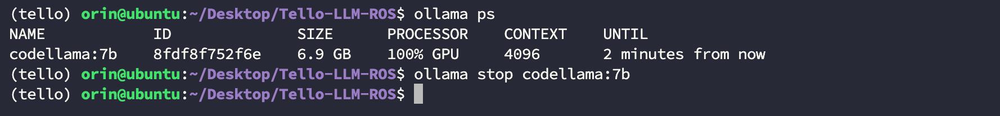
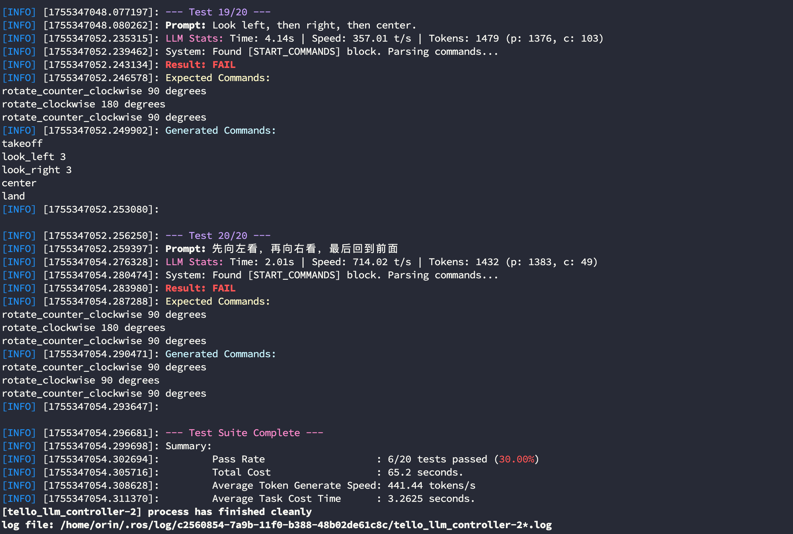
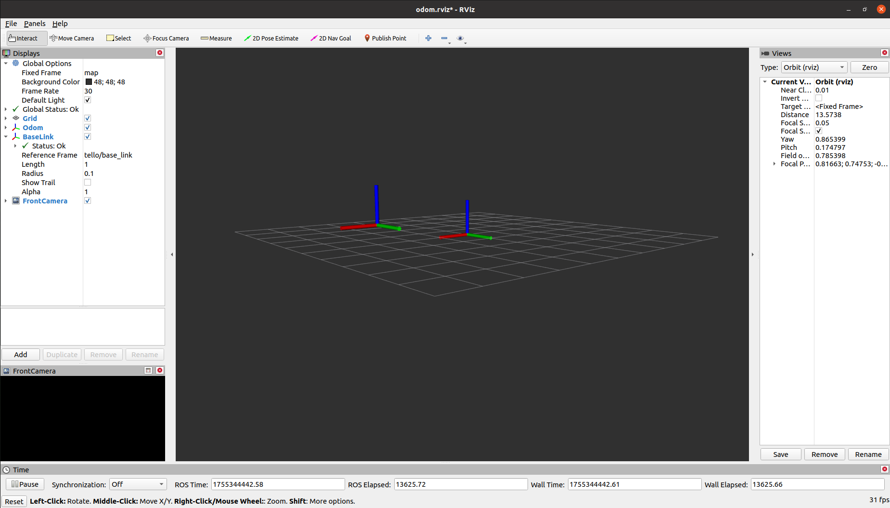
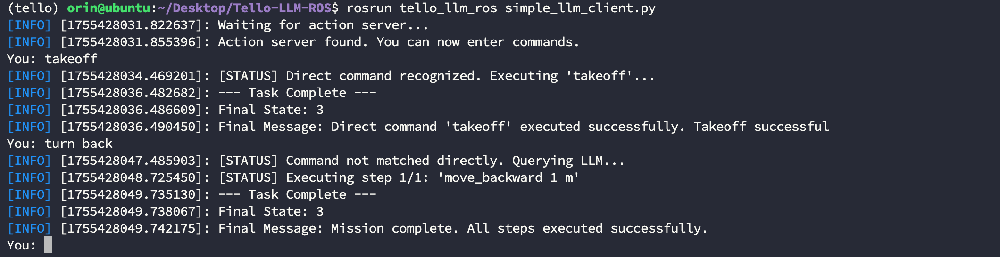

# Tello LLM ROS

这个仓库实现了在 ROS 框架下使用 LLM 对 Tello 无人机进行控制，并以自然语言指令作为输入。当前的版本仅支持通过本地 Ollama 模型的调用，我们正在测试使用在线模型和 Agent 系统的调用方式，一旦完成测试我们将在第一时间更新仓库。

当前我们仅在 `Nvidia Jetson Orin 64GB DK` 这个硬件上开展了实验，未来我们会尝试在更丰富的硬件设备上进行测试。实验环境的系统与库信息如下：



在此基础上我们对多个不同的本地模型性能与表现进行了评估，测试样本可以查看脚本 `src/tello_llm_ros/scripts/test_llm_offline.py` 中 `_define_test_cases` 函数的内容：

|Model|准确率|平均响应时长 s|平均生成速度 tokens/s|
|--|--|--|--|
|Qwen3:4b| | | |
|Qwen3:8b| 60.00% | 52.245 | 40.684 |
|Qwen3:14b| | | |
|CodeLlama:7b|30.00%|3.265|441.44|
|Llama3.1:8b| | | |
|DeepSeek-r1:1.7b| | | |
|DeepSeek-r1:8b| | | |

根据我们的测试结果来看，大部分模型的错误率过高的原因在于频繁生成 `takeoff` 和 `land` 命令，说明本地小参数量模型对长程任务的理解仍然有限，尽管我们已经在系统提示词中添加了前提条件。如果你想要避免每条指令都触发无意义的升降，那么一个可选的方案是做关键词删除，但这种操作可能会导致一些本身带有起降含义的命令失效；

为了尽可能降低整体系统响应时长，我们对一些明确指令采取直接调用的形式，这些指令不会输入模型进行推理，例如 `takeoff`。你也可以添加更多直接运行的指令，修改 `config/llm_tools.json` 文件中 `direct_triggers` 字段如下所示，`takeoff`，`take off`，`launch` 这三条指令都是可以直接响应的：

```json
    {
      "name": "takeoff",
      "description": "Initiates the drone's automatic takeoff sequence...",
      "direct_triggers": [
        "takeoff",
        "take off",
        "launch"
      ],
      "parameters": [],
      "ros_service": "/takeoff",
      "service_type": "Trigger"
    },
```

----
# Step1. 安装依赖库

## 1.1 安装基础依赖库
在运行之前你可能需要安装包括但不限于以下依赖库：

```bash
$ conda install libffi==3.3
```

## 1.2 创建conda环境

```bash
$ conda create -n tello python=3.8
$ conda activate tello
$ pip install -r requirements.txt
```

----
# Step2. 源码编译

进入到你的工程中拉取源码，这里假设为 `tello_ws`：

```bash
$ cd tello_ws/src
$ git clone https://github.com/GaohaoZhou-ops/Tello-LLM-ROS.git
```

拉取完成后即可执行编译：

```bash
$ cd tello_ws
$ catkin_make
```

----
# Step3. 拉取模型

你可以通过下面的命令拉取 Ollama 开源的模型，这里以 `Qwen3:8b` 为例：

```bash
$ ollama pull qwen3:8b
```

----
# 如何使用
我们提供了多种使用模式，包括真机与模型联合测试、模型独立测试、模型与mock联合测试。

## 停止多余模型

在调用模型前，为了避免资源被未关闭的模型抢占，你可以通过下面的命令来关停正在运行的模型：

```bash
$ ollama ps
$ ollama stop codellama:7b
```



## 修改系统提示词

众所周知，系统提示词对模型的性能表现影响很大，尽管工程中的系统提示此内容已经经过了多次打磨，但并不一定适合你的任务。如果你发现模型在表现上无法令人满意，那么可以通过修改系统提示词的方式给模型指令约束。修改文件 `scripts/llm_utils.py` 中的 `create_system_prompt` 函数：

```py
def create_system_prompt(tools_config):
    """
    Dynamically builds the system prompt using the loaded tools config.
    This function is now the single source of truth for the system prompt.
    
    :param tools_config: The loaded tools configuration dictionary.
    :return: The formatted system prompt string.
    """
    prompt = """You are a simple robot command translator. Your ONLY job is to break down a user's request into a list of simple, one-line text commands for a drone, based on the tools provided.
...
```

在提示词中有下面几条规则用来防止无人机频繁起降：

```python
**RULES:**
- **CRITICAL**: The final command sequence MUST be enclosed between `[START_COMMANDS]` and `[END_COMMANDS]` tags.
- Inside the tags, output ONLY the command text, with each command on a new line.
- By default, the drone is already in the air and no additional takeoff call is required, unless there is a clear takeoff instruction.
- Unless there is a clear landing instruction, the land command cannot be called.
```

## 添加工具

我们也将工具功能提取出来并保存到一个 json 文件中，你可以通过修改 `config/llm_tools.json` 文件以添加工具：

```json
  "tools": [
    {
      "name": "takeoff",
      "description": "Initiates the drone's automatic takeoff sequence...",
      "direct_triggers": [
        "takeoff",
        "take off",
        "launch"
      ],
      "parameters": [],
      "ros_service": "/takeoff",
      "service_type": "Trigger"
    },
    // ...
  ]
```

## 测试模型性能

在正式开始之前，我们强烈建议先用我们提供的测试节点测试一下模型在你当前设备上的性能与效率，如果成功率太低或者平均任务反应时长太长，那么建议更换模型。

```bash
$ cd tello_ws
$ source devel/setup.bash
$ roslaunch tello_llm_ros test_llm.launch
```



## 本地模型+仿真测试

在确认好使用的模型后，可以先以 mock 模式运行来测试当前模型的表现是否是你预期的效果，因为测试案例涵盖的样本太少。

* 修改 `launch/tello.launch` 文件中 `use_sim` 字段为 `true` 启用仿真：

```xml
<arg name="use_sim" default="true" doc="Set to true to run in simulation mode"/>
```

* 修改 `launch/llm_interface.launch` 文件中 `ollama_model` 字段为你想要运行的模型：

```xml
<arg name="ollama_model" default="qwen3:4b" doc="The Ollama model to use"/>
```

打开一个终端运行仿真器：
```bash
$ cd tello_ws
$ source devel/setup.bash
$ roslaunch tello_llm_ros tello.launch
```



新开一个终端运行模型交互窗口，通过输入 `quit` 退出节点：
```bash
$ cd tello_ws
$ source devel/setup.bash
$ roslaunch tello_llm_ros llm_interface.launch
```



## 本地模型+真机测试

如果你的模型表现达到你的预期，接下来就可以使用真机进行测试：

* 修改 `launch/tello.launch` 文件中 `use_sim` 字段为 `false` 启用真机：

```xml
<arg name="use_sim" default="true" doc="Set to true to run in simulation mode"/>
```

* 修改 `launch/llm_interface.launch` 文件中 `ollama_model` 字段为你想要运行的模型：

```xml
<arg name="ollama_model" default="qwen3:4b" doc="The Ollama model to use"/>
```

打开一个终端运行真机：
```bash
$ cd tello_ws
$ source devel/setup.bash
$ roslaunch tello_llm_ros tello.launch
```

新开一个终端运行模型交互窗口：
```bash
$ cd tello_ws
$ source devel/setup.bash
$ roslaunch tello_llm_ros llm_interface.launch
```

