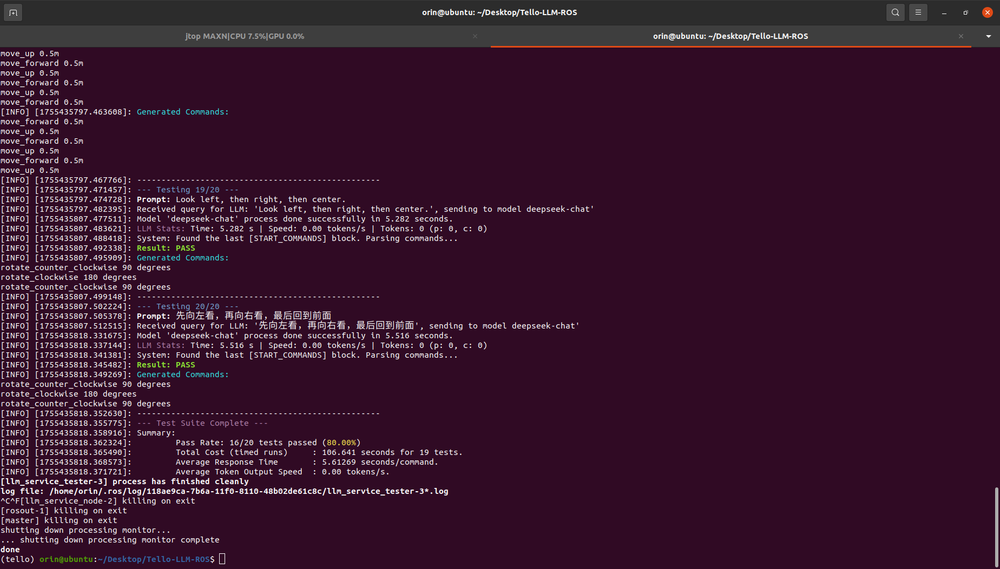
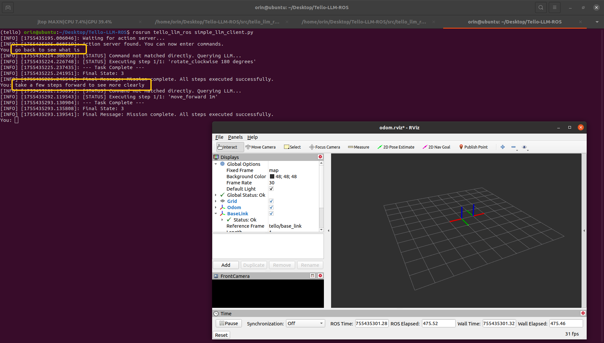
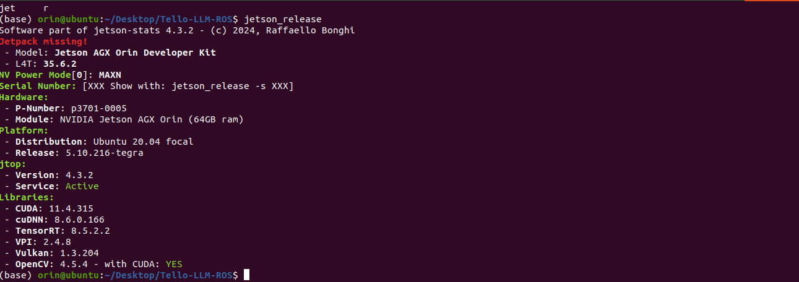

# Tello LLM ROS

这个仓库实现了在 ROS 框架下使用 LLM 对 Tello 无人机进行控制，以自然语言指令作为输入结合提示词和 tools 定义让模型输出无人机控制指令。目前支持多种组合调试方式：

|Model| Drone | Support |
|---|---|---|
| Ollama Local | Simulate & Real | ✅ |
| deepseek-chat |Simulate & Real | ✅ |
| gemini-2.5-flash | Simulate & Real | ✅ |
| LAN Server | Simulate & Real | ✅ |
| gpt-40 Online | Simulate & Real | ✅ |
| Ernie Online | Simulate & Real | ✅ |

同时，我们还对部分本地/在线模型进行了测试，你可以查看这篇文档的 `Benchmarks` 章节了解更多详情。

如果你想要通过 XBox 手柄对无人机实现控制，可以参考我们另两个开源项目：

* [XBox Controller Reader](https://github.com/GaohaoZhou-ops/XboxControllerReader)：不依赖于ROS可以在远端启动；
* [xbox_controller_pkg](https://github.com/GaohaoZhou-ops/xbox_controller_pkg)：ROS 节点封装版；


如果你想要在部署同一个局域网内的本地服务器推理客户端，那么按照这个篇 [ReadMe](../LAN-Server/ReadMe.md) 文件操作即可。

# 🎉 News!

### 2025年08月19日 星期二

* V0.1.0 版本发布，下一版将引入 Agent 框架，敬请期待！
* 新增了拍摄照片和录制视频的功能；
* 统一了支持 openai 协议调用方式的客户端代码；
* 添加了拍摄一张照片以及录制指定时长视频的功能；
* 添加了思考模式以及历史记录信息；

### 2025年08月18日 星期一

* 新增了 Gemini、本地局域网服务器、OpenAI 的调用支持；

### 2025年08月17日 星期日

* 我们大范围重构了这个工程，现在支持本地 Ollama 和在线 DeepSeek API 两种调用方式，更多常用模型的客户端正在开发中，敬请期待。

### 2025年08月15日 星期六

* 统一了模型测试和应用时的提示词生成；

-----
## 1. 安装与部署 🪤

无论你是否使用本地模型都需要对基础环境进行配置与部署，按照下面的流程操作即可完成这部分内容。


### 1.1 安装基础依赖库
在运行之前你可能需要安装包括但不限于以下依赖库：

```bash
$ conda install libffi==3.3
```

### 1.2 创建conda环境

```bash
$ conda create -n tello python=3.8
$ conda activate tello
$ pip install -r requirements.txt
```

### 1.3 源码编译

进入到你的工程中拉取源码，这里假设为 `tello_ws`：

```bash
$ cd tello_ws/src
$ git clone https://github.com/GaohaoZhou-ops/Tello-LLM-ROS.git
```

拉取完成后即可执行编译：

```bash
$ cd tello_ws
$ catkin_make
```

### 1.4 Google Gemini

如果你准备使用 Google Gemini 在线模型，并且你的 conda 环境是 `python 3.9+`，那么还需要参考下面的链接安装 `gcloud CIL`，但是要注意这一步尽量在我们的创建的 conda 环境中安装：

* Google Cloud CIL：[https://cloud.google.com/sdk/docs/install?hl=zh-cn#linux](https://cloud.google.com/sdk/docs/install?hl=zh-cn#linux)

完成安装后在本地执行下面的命令并根据提示完成 Google Cloud 的登陆操作：

```bash
$ source ~/.bashrc
$ gcloud auth application-default login
```

然后将 `llm_models/gemini_client_for_py39+.py` 文件重命名为 `gemini_client.py` 并覆盖。

如果你的 conda 环境和我们测试环境一样，那么可以直接使用。

-----
## 2. 如何使用 💻

工程支持本地与在线模型调用方式，这一章将介绍如何使用整个工程。

### 2.1 配置提示词语工具 🔔
无论你选择本地还是在线模型调用，我们都建议你认真查看提示词内容并在必要时修改提示词以更好地适配你当前的任务。工程给语言模型提供的提示词文件保存在 `config` 目录下，其中 `prompts` 目录中提供了多个语言版本的系统提示词以及纯文本的提示词文件，这样设计出于以下几点考量：

1. 测试发现对于 <font color=blue>**本地模型**</font> 而言，使用纯文本描述 tools 会显著提升正确率，这可能是由于解析 json 文件会产生额外的 tokens，这对于小参数模型的长程记忆而言不友好；
2. 我们也建议使用纯文本提示词的方式调用 <font color=green>**在线模型**</font>，因为这样可以降低 API tokens 的消耗；


```bash
.
├── prompts
│   ├── common_system_prompt-CN.txt           # 通用系统提示词
│   ├── common_system_prompt-EN.txt
│   ├── pure_text_tools_description-CN.txt    # tools 描述文本
│   └── pure_text_tools_description-EN.txt
├── test_cases.json       # 模型测试案例
└── tools.json            # tools 描述文件
```

你可以对这些文件进行修改，但需要注意的是，如果新增或修改了工具，那么需要对源码中对应工具的代码同步修改。

### 2.2 模型性能测试 🌟

我们强烈建议在使用真机与仿真之前先对你选择的模型进行一次简单的测试，`config/test_cases.json` 文件描述了测试案例，你可以根据自己的任务的需求增加或删除测试案例。

文件 `launch/llm_service.launch` 中的几个参数决定了测试环境使用的模型：

```xml
  <arg name="model_type"      default="deepseek"/>
  <arg name="model_name"      default="deepseek-chat"/>
  <arg name="api_key"         default="Your online mode API Key" /> 
```

* `model_type`：模型类型，当前版本仅支持 `ollama` 和 `deepseek`；
* `model_name`：模型名；
* `api_key`：如果你使用的是本地 ollama 模型，那么这个参数可以为空；

有关模型类型、模型名、url 连接可以参考文件 `launch/supported_model_config`，这个文件中的内容是我们测试时使用的配置。

然后使用下面的命令运行模型性能测试：

```bash
$ cd tello_llm_ros
$ source devel/setup.bash 
$ roslaunch tello_llm_ros llm_test.launch
```



### 2.2 联合调试

在确定好使用的模型后就可以进入联合调试阶段，工程提供了多种联调方式。

#### 本地 Ollama 

如果你打算使用本地模型，那么必须在运行之前拉取模型，我们建议使用 `llama3.1:8b 4.9GB` 这个模型，因为在我们的 benckmark 中，该模型平衡了正确率与输出速度，尽管与在线模型相比其正确率依旧不高。

```bash
$ ollama pull llama3.1:8b
```

#### 仿真控制

如果你有其他特殊需求，比如需要调试服务器上的视觉 SLAM 是否可以正常运行，那么可以仅开启一个无人机仿真节点，尽管这个节点不会有任何图像生成，但会持续发布一张纯黑色的照片。

下面脚本中 `use_sim` 参数决定了是否进行仿真，然后就可以通过话题控制无人机起飞、降落等动作：

```bash
$ roslaunch tello_llm_ros tello.launch 
```


#### 仿真 + LLM

在进行真机实验之前建议先在仿真中完成LLM的调试，在启动下面几个脚本后就可以在终端向 LLM 发送指令：

```bash
# Terminal 1
$ roslaunch tello_llm_ros tello.launch 

# Terminal 2
$ unset all_proxy
$ unset ALL_PROXY
$ roslaunch tello_llm_ros control_node.launch
```

在这些节点启动成功后可以新开一个终端启动 Simple Client，如果输入为 `quit` 则终止程序：

```bash
$ rosrun tello_llm_ros simple_llm_client.py
```

下面的例子调用了在线 `DeepSeek-Chat` 模型并分别给出了 2 条命令：

* `go back to seen what is`;
* `take a few steps forward to seen more clearly`;



#### 真机 + LLM

在仿真中调通了整个流程后就可以启动真机进行联调了，操作步骤与上面一直，但记得需要修改 `launch/tello.launch` 文件中的 `use_sim` 参数，将其改成 `false`。

-----
# Benchmarks 🏃

## 本地模型测试
当前我们仅在 `Nvidia Jetson Orin 64GB DK` 这个硬件上开展了实验，未来我们会尝试在更丰富的硬件设备上进行测试。实验环境的系统与库信息如下：



在此基础上我们对多个不同的本地模型性能与表现进行了评估，测试样本可以查看文件 `src/tello_llm_ros/config/test_cases.json` 中的示例：

|Model|大小|准确率|平均响应时长 s|平均生成速度 tokens/s|
|--|--|--|--|--|
| codellama:7b | 3.8 GB | 35.00% | 1.58 | 433.53 |
| codellama:13b | 4.7 GB | 55.00% | 3.44 | 191.98 |
| codellama:34b | 19.0 GB | 50.00% | 7.84 | 84.70 |
| llama3.1:8b | 4.9 GB | 60.00% | 2.04 | 257.65 |
| llama3-groq-tool-use:8b | 4.7 GB | 50.00% | 2.03 | 261.59 |
| qwen3:4b | 2.5 GB | 50.00% | 80.61 | 32.65 | 
| qwen3:8b | 5.2 GB | 65.00% | 35.19 | 34.17 | 
| qwen3:14b | 9.3 GB | 65.00% | 45.806 | 23.50 |
| deepseek-coder-v2:16b | 8.9 GB | 60.00% | 1.56 | 376.31 | 
| gpt-oss:20b | 13 GB | 70.00% | 24.05 | 33.81 |

我们初步的实验得到了以下几点结论：

1. 大多数本地模型测试样本失败是由于添加了额外的 `takeoff` 和 `land` 命令；
2. 对于本地小参数量的模型而言，使用纯文本系统提示词比使用 json 定义工具描述成功率更高；
3. 本地模型容易将一个动作拆成多个动作指令，这可能和系统提示词有关，例如 “旋转180度”，模型会输出2次 “旋转90度”的命令；
4. Code 类型的本地模型在单个任务上的响应速度远超通用模型；

为了尽可能降低整体系统响应时长，我们对一些明确指令采取直接调用的形式，这些指令不会输入模型进行推理，例如 `takeoff`。你也可以添加更多直接运行的指令，修改 `config/llm_tools.json` 文件中 `direct_triggers` 字段如下所示，`takeoff`，`take off`，`launch` 这三条指令都是可以直接响应的：

```json
    {
      "name": "takeoff",
      "description": "Initiates the drone's automatic takeoff sequence...",
      "direct_triggers": [
        "takeoff",
        "take off",
        "launch"
      ],
      "parameters": [],
      "ros_service": "/takeoff",
      "service_type": "Trigger"
    },
```

## 在线模型测试 🌐

在线模型部分我们当前仅测试了 `DeepSeek-Chat` 这款模型，`ChatGPT` 和 `Gemini` 的测试正在开展。

|Model|准确率|平均响应时长 s|
|--|--|--|
| deepSeek-chat | 85.00% | 4.84 |
| gemini-2.5-flash | 95.00% | 5.12 |
| gpt-4o | 95.00% | 4.44 |
| ernie-4.0-turbo-8k | 95.00% | 2.82 |
| qwen-plus | 85.00% | 1.10 |

