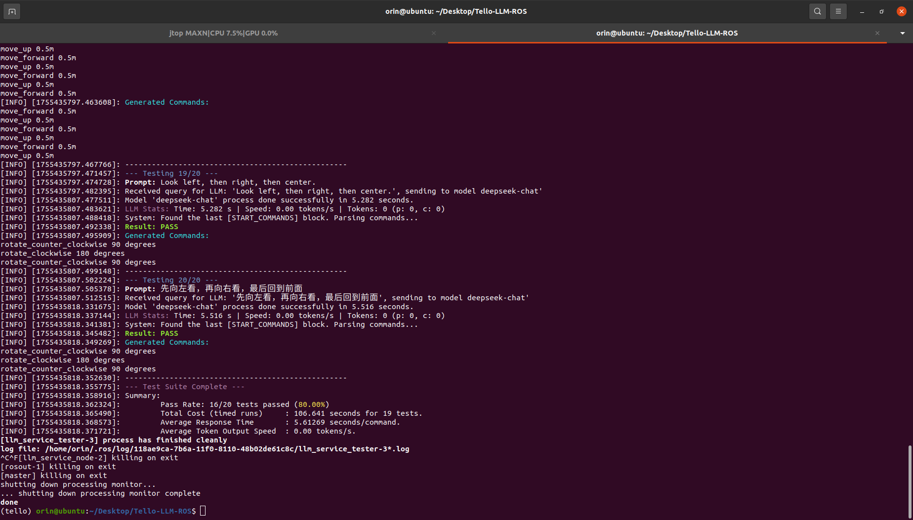
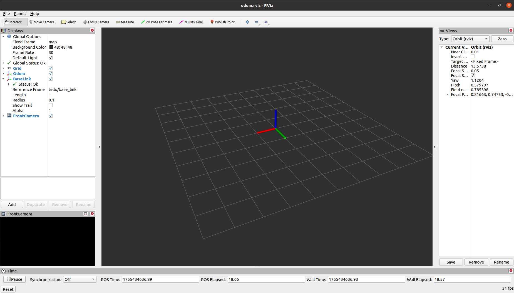
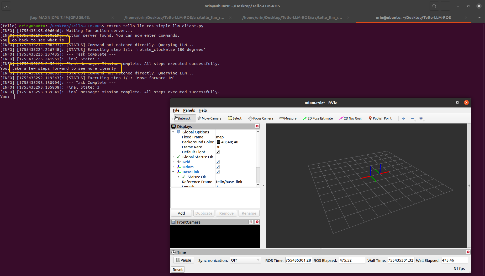
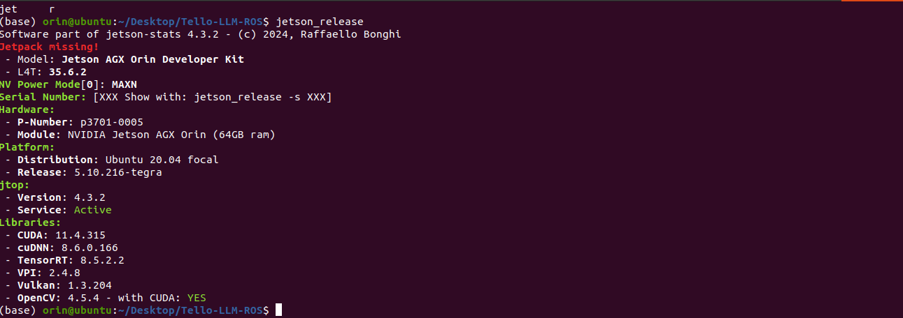

# Tello LLM ROS

This repository implements controlling the Tello drone using LLM within the ROS framework. It takes natural language commands as input, combines them with prompts and tools definitions, and outputs drone control commands. Currently, multiple debugging combinations are supported:

|Model|Drone|Support|
|---|---|---|
| Ollama Local | Simulate & Real | ✅ |
| DeepSeek Online |Simulate & Real | ✅ |
| Gemine Oline | Simulate & Real | ✅ |
| LAN Server | Simulate & Real | ✅ |
| GPT-4 Online | Simulate & Real | ✅ |
| Ernie Online | Simulate & Real | ✅ |

We've also tested some local and online models. Please refer to the `Benchmark` section of this document for more details.

If you want to control the drone with an XBox controller, you can refer to our other open source project:

* [XBox Controller Reader](https://github.com/GaohaoZhou-ops/XboxControllerReader): Independent of ROS, can be started remotely.
* [xbox_controller_pkg](https://github.com/GaohaoZhou-ops/xbox_controller_pkg): ROS node package.

If you want to deploy the inference client on a local server within the same LAN, just follow the instructions in the [ReadMe](../LAN-Server/ReadMe.md) file.

# 🎉 News!

### Monday, August 18, 2025

Added support for the Gemini, local LAN servers, OpenAI client call;

### Sunday, August 17, 2025

We've extensively refactored this project and now support both local Ollama and online DeepSeek APIs. Clients for more common models are in development, so stay tuned.

### Saturday, August 15, 2025

Unified prompt generation for model testing and application.

-----
## 1. Installation and Deployment 🪤

Whether or not you use local models, you'll need to configure and deploy the basic environment. Follow the steps below to complete this.

### 1.1 Installing Basic Dependencies
Before running, you may need to install the following dependencies, including but not limited to:

```bash
$ conda install libffi==3.3
```

### 1.2 Creating a Conda Environment

```bash
$ conda create -n tello python=3.8
$ conda activate tello
$ pip install -r requirements.txt
```

### 1.3 Compiling from Source

Enter your project and pull down the source code. Here, we assume it's `tello_ws`:

```bash
$ cd tello_ws/src
$ git clone https://github.com/GaohaoZhou-ops/Tello-LLM-ROS.git
```

Once the source code is pulled down, you can compile:

```bash
$ cd tello_ws
$ catkin_make
```

-----
## 2. How to Use 💻

This project supports both local and online model invocation. This chapter explains how to use the entire project.

### 2.1 Configuring the Prompt Term Tool 🔔
Whether you choose to invoke the model locally or online, we recommend carefully reviewing the prompt terms and modifying them, if necessary, to better suit your current task. The project's prompt files for the language model are stored in the `config` directory. The `prompts` directory provides system prompts in multiple languages, as well as pure language prompts. This design is based on the following considerations:

1. Testing has found that using plain text to describe tools significantly improves accuracy for the local model. This is likely due to the extra tokens generated by parsing the JSON file, which is not conducive to long-term memory for small-parameter models.
2. We also recommend using plain text prompts when calling the online model, as this reduces API token consumption.

```bash
.
├── prompts
│ ├── common_system_prompt-CN.txt # Common system prompts
│ ├── common_system_prompt-EN.txt
│ ├── pure_text_tools_description-CN.txt # Tools description
│ └── pure_text_tools_description-EN.txt
├── test_cases.json # Model test cases
└── tools.json # Tools description file
```

You can modify these files, but please note that if you add or modify a tool, you must also modify the corresponding tool code in the source code.

### 2.2 Model Performance Testing 🌟

We strongly recommend running a simple test of your selected model before using it on a real device or in simulation. The `config/test_cases.json` file describes the test cases. You can add or delete test cases based on your task requirements.

Several parameters in the `launch/llm_service.launch` file determine the model used in the test environment:

```xml
<arg name="model_type" default="deepseek"/>
<arg name="model_name" default="deepseek-chat"/>
<arg name="api_key" default="Your online mode API Key" />
```

* `model_type`: Model type. The current version only supports `ollama` and `deepseek`.
* `model_name`: Model name.
* `api_key`: If you are using a local ollama model, this parameter can be left blank.

Run the model performance test using the following command:

```bash
$ cd tello_llm_ros
$ source devel/setup.bash
$ roslaunch tello_llm_ros llm_test.launch
```



### 2.2 Joint Debugging

Once you've determined the model to use, you can begin the joint debugging phase. The project provides multiple joint debugging methods.

#### Local Ollama

If you plan to use a local model, you must pull the model before running. We recommend using the `llama3.1:8b 4.9GB` model, as it strikes a balance between accuracy and output speed in our benchmark, although its accuracy is still lower than that of online models.

```bash
$ ollama pull llama3.1:8b
```

#### Simulation Control

If you have special needs, such as debugging the proper functioning of the visual SLAM system on the server, you can simply start a drone simulation node. Although this node will not generate any images, it will continuously publish a solid black image.

The `use_sim` parameter in the following script determines whether to run simulation. This allows you to control the drone's takeoff, landing, and other actions through topics:

```bash
$ roslaunch tello_llm_ros tello.launch
```



#### Simulation + LLM

Before conducting real-device experiments, it is recommended to complete the LLM debugging in simulation. After running the following scripts, you can send commands to the LLM in the terminal:

```bash
# Terminal 1
$ roslaunch tello_llm_ros tello.launch

# Terminal 2
$ unset all_proxy
$ unset ALL_PROXY
$ roslaunch tello_llm_ros control_node.launch
```

After these nodes are successfully started, you can open a new terminal and start the Simple Client. Entering `quit` terminates the program:

```bash
$ rosrun tello_llm_ros simple_llm_client.py
```

The following example calls the online `DeepSeek-Chat` model and gives two commands:

* `go back to seen what is`;
* `take a few steps forward to seen more clearly`;



#### Real Device + LLM

After debugging the entire process in simulation, you can start the real device for joint debugging. The steps are the same as above, but remember to change the `use_sim` parameter in the `launch/tello.launch` file to `false`.

-----
# Benchmarks 🏃

## Local Model Testing
Currently, we have only conducted experiments on the `Nvidia Jetson Orin 64GB DK` hardware. In the future, we will try to test on more hardware devices. The system and library information for the experimental environment are as follows:



Based on this, we evaluated the performance of several different local models. For test samples, see the `_define_test_cases` function in the `src/tello_llm_ros/scripts/test_llm_offline.py` script:

|Model|Size|Accuracy|Average Response Time s|Average Generation Rate tokens/s|
|--|--|--|--|--|
| codellama:7b | 3.8 GB | 35.00% | 1.58 | 433.53 |
| codellama:13b | 4.7 GB | 55.00% | 3.44 | 191.98 |
| codellama:34b | 19.0 GB | 50.00% | 7.84 | 84.70 |
| llama3.1:8b | 4.9 GB | 60.00% | 2.04 | 257.65 |
| llama3-groq-tool-use:8b | 4.7 GB | 50.00% | 2.03 | 261.59 |
| qwen3:4b | 2.5 GB | 50.00% | 80.61 | 32.65 |
| qwen3:8b | 5.2 GB | 65.00% | 35.19 | 34.17 |
| qwen3:14b | 9.3 GB | 65.00% | 45.806 | 23.50 |
| deepseek-coder-v2:16b | 8.9 GB | 60.00% | 1.56 | 376.31 |
| gpt-oss:20b | 13 GB | 70.00% | 24.05 | 33.81 |

Our preliminary experiments yielded the following conclusions:

1. Most local model test cases failed due to the addition of the `takeoff` and `land` commands.

2. For local models with small parameter counts, using plain text system prompts yields higher success rates than using JSON tool descriptions.

3. Local models tend to split a single action into multiple commands, which may be related to the system prompts. For example, for "rotate 180 degrees," the model will output the command "rotate 90 degrees" twice.

4. Code-type local models respond much faster on a single task than general-purpose models.

To minimize overall system response time, we use direct calls for some explicit commands, such as `takeoff`. These commands are not fed into the model for inference. You can also add more direct commands by modifying the `direct_triggers` field in the `config/llm_tools.json` file as follows. The `takeoff`, `take off`, and `launch` commands can all be directly executed:

```json
{
"name": "takeoff",
"description": "Initiates the drone's automatic takeoff sequence...",
"direct_triggers": [
"takeoff",
"take off",
"launch"
],
"parameters": [],
"ros_service": "/takeoff",
"service_type": "Trigger"
},
```

## Online Model Testing 🌐

For online models, we have currently only tested the `DeepSeek-Chat` model. Testing of `ChatGPT` and `Gemini` is in progress.

|Model|Accuracy|Average Response Time (s)|
|--|--|--|
| DeepSeek-Chat | 80.00% | 4.84 |
| Gemini-2.5-flash | 85.00% | 5.12 |
| GPT-4 | 85.00% | 5.88 |
| Ernie | 80.00% | 6.13 |
