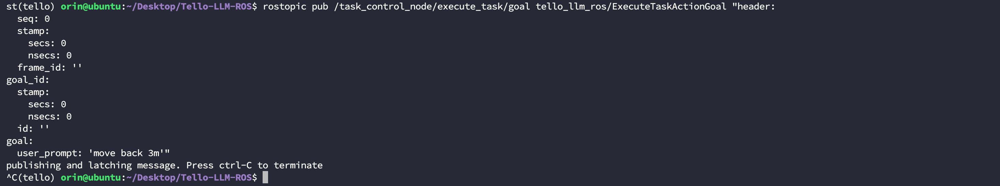

# Tello LLM ROS

This repository implements controlling the Tello drone using LLM within the ROS framework, accepting natural language commands as input. The current version only supports calling it through the local Ollama model. We are currently testing calling it using online models and agent systems, and will update the repository as soon as testing is complete.

# Benchmarks

## Local Model Testing
Currently, we have only conducted experiments on the Nvidia Jetson Orin 64GB DK. We will explore testing on a wider range of hardware devices in the future. The system and library information for the experimental environment are as follows:


Based on this, we evaluated the performance of several different local models. For test samples, see the `_define_test_cases` function in the `src/tello_llm_ros/scripts/test_llm_offline.py` script:

|Model|Size|Accuracy|Average Response Time s|Average Generation Rate tokens/s|
|--|--|--|--|--|
| codellama:7b | 3.8 GB | 35.00% | 1.58 | 433.53 |
| codellama:13b | 4.7 GB | 55.00% | 3.44 | 191.98 |
| codellama:34b | 19.0 GB | 50.00% | 7.84 | 84.70 |
| llama3.1:8b | 4.9 GB | 60.00% | 2.04 | 257.65 |
| llama3-groq-tool-use:8b | 4.7 GB | 50.00% | 2.03 | 261.59 |
| qwen3:4b | 2.5 GB | 50.00% | 80.61 | 32.65 |
| qwen3:8b | 5.2 GB | 65.00% | 35.19 | 34.17 |
| qwen3:14b | 9.3 GB | 65.00% | 45.806 | 23.50 |
| deepseek-coder-v2:16b | 8.9 GB | 60.00% | 1.56 | 376.31 |
| gpt-oss:20b | 13 GB | 70.00% | 24.05 | 33.81 |

Our preliminary experiments yielded the following conclusions:

1. Most local model test cases failed due to the addition of the `takeoff` and `land` commands.

2. For local models with small parameter counts, using plain text system prompts yields higher success rates than using JSON tool descriptions.

3. Local models tend to split a single action into multiple commands, which may be related to the system prompts. For example, for "rotate 180 degrees," the model will output the command "rotate 90 degrees" twice.

4. Code-type local models respond much faster on a single task than general-purpose models.

To minimize overall system response time, we implement direct calls for some explicit commands, such as `takeoff`. These commands are not fed into the model for inference. You can also add more direct execution commands by modifying the `direct_triggers` field in the `config/llm_tools.json` file as follows. The `takeoff`, `take off`, and `launch` commands can all be directly executed:

```json
{
"name": "takeoff",
"description": "Initiates the drone's automatic takeoff sequence...",
"direct_triggers": [
"takeoff",
"take off",
"launch"
],
"parameters": [],
"ros_service": "/takeoff",
"service_type": "Trigger"
},
```

## Online Model Testing

Comming Soon...

----
# Step 1. Install Dependencies

## 1.1 Install Basic Dependencies
Before running, you may need to install the following dependencies, including but not limited to:

```bash
$ conda install libffi==3.3
```

## 1.2 Create a conda environment

```bash
$ conda create -n tello python=3.8
$ conda activate tello
$ pip install -r requirements.txt
```

----
# Step 2. Compile the Source Code

Enter your project and pull the source code. Here, we assume it's `tello_ws`:

```bash
$ cd tello_ws/src
$ git clone https://github.com/GaohaoZhou-ops/Tello-LLM-ROS.git
```

Once the pull is complete, you can compile:

```bash
$ cd tello_ws
$ catkin_make
```

----
# Step 3. Pull the Model

You can pull the Ollama open-source model using the following command. Here, we use `Qwen3:8b` as an example:

```bash
$ ollama pull qwen3:8b
```

----
# How to Use
We provide multiple usage modes, including testing on a real device and the model, testing the model independently, and testing the model and a mock.

If you want to control the drone with an XBox controller, you can use our other open-source repository:

* XBox Controller Reader: [https://github.com/GaohaoZhou-ops/XboxControllerReader](https://github.com/GaohaoZhou-ops/XboxControllerReader)

## Stopping Unnecessary Models

Before calling a model, to avoid resources being preempted by open models, you can shut down the running model using the following command:

```bash
$ ollama ps
$ ollama stop codellama:7b
```


## Modifying System Prompts

As we all know, system prompts significantly impact model performance. Although the system prompts in the project have been carefully polished, they may not be suitable for your task. If you find that the model's performance is unsatisfactory, you can constrain the model by modifying the system prompt words. We split the system prompt into two parts: `Common System Prompt` and `Tool Description`. These files are saved in the `config` directory. The final system prompt is a concatenation of the two parts:

```bash
├── config
│ ├── prompts
│ │ ├── common_system_prompt-CN.txt
│ │ ├── common_system_prompt-EN.txt
│ │ ├── pure_text_tools_description-CN.txt
│ │ └── pure_text_tools_description-EN.txt
│ ├── test_cases.json
│ └── tools.json
```

## Adding Tools

If you plan to use a large model, it is recommended to modify the `config/tools.json` file to define your tool content.

If you plan to use a small model, it is recommended to modify the plain text file. Define your tools in `config/prompts/common_system_prompt-EN.txt`;

Regardless of which method you choose to add tools, you'll need to implement your own scripts for the corresponding functionality.

## Offline Model Testing

Before officially starting, we strongly recommend testing the model's performance and efficiency on your current device using the provided test nodes. If the success rate is too low or the average task response time is too long, we recommend replacing the model.

```bash
$ unset all_proxy
$ unset ALL_PROXY
$ cd tello_ws
$ source devel/setup.bash
$ roslaunch tello_llm_ros offline_llm_test.launch
```


## Running on a real device or simulator

You can change the `use_sim` field in `launch/tello.launch` to use a real device or simulator:

```xml
<node name="$(arg drone_name)_driver" pkg="tello_llm_ros" type="tello_ros_driver.py" output="screen">
<param name="drone_name" value="$(arg drone_name)" />
<param name="use_sim" value="$(arg use_sim)" />
<param name="cmd_vel_timeout" value="$(arg cmd_vel_timeout)"/>
</node>
```

Modify `model_name` in the `launch/llm_bringup.launch` file to use your own model:

```xml
<node name="llm_service_node" pkg="tello_llm_ros" type="llm_service_node.py" output="screen">
<param name="model_name" value="codellama:7b"/>
<param name="model_type" value="ollama"/>
<param name="timeout" value="100.0"/>
<param name="common_system_prompt_file" value="$(arg common_prompt)"/>
<param name="tools_description_file" value="$(arg tools_prompt)"/>
</node>
```

After completing the modification, launch the following nodes in different terminals:

```bash
# Terminal 1
$ roslaunch tello_llm_ros tello.launch

# Terminal 2
$ roslaunch tello_llm_ros control_node.launch

# Terminal 3
$ roslaunch tello_llm_ros llm_bringup.launch
```

You can now enter interactive mode using a simple client and exit by typing `quit`:

```bash
$ rosrun tello_llm_ros simple_llm_client.py
```


Or, you can publish a simple command to the topic directly in the terminal:

```bash
$ rostopic pub /task_control_node/execute_task/goal tello_llm_ros/ExecuteTaskActionGoal "header:
seq: 0
stamp:
secs: 0
nsecs: 0
frame_id: ''
goal_id:
stamp: 
secs: 0 
nsecs: 0 
id: ''
goal: 
user_prompt: 'move back 3m'"
```


