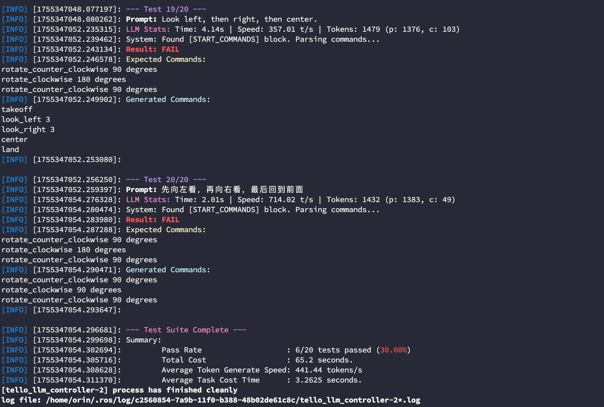

# Tello LLM ROS

This repository implements LLM control of the Tello drone within the ROS framework, accepting natural language commands as input. The current version only supports calling it through the local Ollama model. We are currently testing calling it using online models and agent systems, and will update the repository as soon as testing is complete.

# Benchmarks

## Local Model Test
Currently, we have only conducted experiments on the Nvidia Jetson Orin 64GB DK hardware. We will explore testing on a wider range of hardware devices in the future. The system and library information for the experimental environment are as follows:


Based on this, we evaluated the performance of several different local models. For test samples, see the `_define_test_cases` function in the `src/tello_llm_ros/scripts/test_llm_offline.py` script:

|Model| Size | Accuracy|Average Response Time s|Average Generation Rate tokens/s|
|--|--|--|--|--|
| codellama:7b | 3.8 GB | 35.00% | 1.58 | 433.53 |
| codellama:13b | 4.7 GB | 55.00% | 3.44 | 191.98 |
| llama3.1:8b | 4.9 GB | 60.00% | 2.04 | 257.65 |
| llama3-groq-tool-use:8b | 4.7 GB | 50.00% | 2.03 | 261.59 |
| qwen3:4b | 2.5 GB | 50.00% | 80.61 | 32.65 | 
| qwen3:8b | 5.2 GB | 65.00% | 35.19 | 34.17 | 
| qwen3:14b | 9.3 GB | | | |
| deepseek-coder-v2:16b | 8.9 GB | 60.00% | 1.56 | 376.31 | 
| gpt-oss:20b | 14 GB | | | |

Our preliminary experiments yielded the following conclusions:

1. Most local model test cases failed due to the addition of the `takeoff` and `land` commands.
2. For local models with small parameter counts, using plain text system prompts has a higher success rate than using JSON tool descriptions.
3. Local models tend to split a single action into multiple commands, which may be related to the system prompts. For example, for "rotate 180 degrees," the model would output the command "rotate 90 degrees" twice.

To minimize overall system response time, we implemented direct calls for some explicit commands, such as `takeoff`. These commands are not fed into the model for inference. You can also add more direct commands by modifying the `direct_triggers` field in the `config/llm_tools.json` file as follows. The `takeoff`, `take off`, and `launch` commands can all be directly executed:

```json
{
"name": "takeoff",
"description": "Initiates the drone's automatic takeoff sequence...",
"direct_triggers": [
"takeoff",
"take off",
"launch"
],
"parameters": [],
"ros_service": "/takeoff",
"service_type": "Trigger"
},
```

## Online Mode Test

Comming Soon...

----
# Step 1. Install Dependencies

## 1.1 Install Basic Dependencies
Before running, you may need to install the following dependencies, including but not limited to:

```bash
$ conda install libffi==3.3
```

## 1.2 Create a conda environment

```bash
$ conda create -n tello python=3.8
$ conda activate tello
$ pip install -r requirements.txt
```

----
# Step 2. Compile the Source Code

Enter your project and pull the source code. Here, we assume it's `tello_ws`:

```bash
$ cd tello_ws/src
$ git clone https://github.com/GaohaoZhou-ops/Tello-LLM-ROS.git
```

After pulling the code, you can compile it:

```bash
$ cd tello_ws
$ catkin_make
```

----
# Step 3. Pull the Model

You can pull the Ollama open-source model using the following command. Here, we use `Qwen3:8b` as an example:

```bash
$ ollama pull qwen3:8b
```

----
# How to Use
We provide multiple usage modes, including real-device and model testing, standalone model testing, and model and mock testing.

If you want to control the drone with an XBox controller, you can use our other open-source repository:

* XBox Controller Reader: [https://github.com/GaohaoZhou-ops/XboxControllerReader](https://github.com/GaohaoZhou-ops/XboxControllerReader)

## Stopping Unnecessary Models

Before calling a model, to avoid resources being preempted by open models, you can shut down the running model using the following command:

```bash
$ ollama ps
$ ollama stop codellama:7b
```


## Modifying System Prompts

As we all know, system prompts significantly impact model performance. While the system prompts in our project have been refined, they may not be suitable for your task. If you find that your model's performance is unsatisfactory, you can modify the system prompts to constrain them. We break system prompts into two parts: `Common System Prompts` and `Tool Descriptions`. These files are saved in the `config` directory. The final system prompt is a concatenation of the two parts:

```bash
├── config
│ ├── common_system_prompt-CN.txt
│ ├── common_system_prompt-EN.txt
│ ├── llm_tools.json
│ ├── pure_text_tools_description-CN.txt
│ └── pure_text_tools_description-EN.txt
```

## Adding Tools

If you plan to use a large model, we recommend modifying the `config/llm_tools.json` file to define your tool content.

If you plan to use a small model, we recommend modifying the `config/pure_text_system_prompt-EN.txt` file to define your tool content.

Regardless of which method you choose to add tools, you must implement them yourself.

## Testing Model Performance

Before officially starting, we strongly recommend using the provided test nodes to test the model's performance and efficiency on your current device. If the success rate is too low or the average task response time is too long, we recommend replacing the model.

```bash
$ unset all_proxy
$ unset ALL_PROXY
$ cd tello_ws
$ source devel/setup.bash
$ roslaunch tello_llm_ros test_llm.launch
```



## Local Model + Simulation Test

After confirming the model to use, you can first run it in mock mode to test whether the current model performs as expected, as the test case covers too few samples.

* Modify the `use_sim` field in the `launch/tello.launch` file to `true` to enable simulation:

```xml
<arg name="use_sim" default="true" doc="Set to true to run in simulation mode"/>
```

* Modify the `ollama_model` field in the `launch/llm_interface.launch` file to the model you want to run:

```xml
<arg name="ollama_model" default="qwen3:4b" doc="The Ollama model to use"/>
```

Open a terminal and run the simulator:
```bash
$ cd tello_ws
$ source devel/setup.bash
$ roslaunch tello_llm_ros tello.launch
```


Open a new terminal and run the model interaction window. Exit the node by typing `quit`:
```bash
$ unset all_proxy
$ unset ALL_PROXY
$ cd tello_ws
$ source devel/setup.bash
$ roslaunch tello_llm_ros llm_interface.launch
```


## Local Model + Real Device Testing

If your model performs as expected, you can now test it on a real device:

* Change the `use_sim` field in the `launch/tello.launch` file to `false` Enable the real machine:

```xml
<arg name="use_sim" default="true" doc="Set to true to run in simulation mode"/>
```

* Modify the `ollama_model` field in the `launch/llm_interface.launch` file to the model you want to run:

```xml
<arg name="ollama_model" default="qwen3:4b" doc="The Ollama model to use"/>
```

Open a terminal and run the real machine:
```bash
$ cd tello_ws
$ source devel/setup.bash
$ roslaunch tello_llm_ros tello.launch
```

Open a new terminal to run the model interaction window and exit the node by typing `quit`:
```bash
$ unset all_proxy
$ unset ALL_PROXY
$ cd tello_ws
$ source devel/setup.bash
$ roslaunch tello_llm_ros llm_interface.launch
```


## Local Model + Real Device Testing

If your model performs as expected, you can now test it on a real device:

* Modify the `use_sim` field in the `launch/tello.launch` file to `false` to enable the real device:

```xml
<arg name="use_sim" default="true" doc="Set to true to run in simulation mode"/>
```

* Modify the `ollama_model` field in the `launch/llm_interface.launch` file The field contains the model you want to run:

```xml
<arg name="ollama_model" default="qwen3:4b" doc="The Ollama model to use"/>
```

Open a terminal and run the real machine:
```bash
$ cd tello_ws
$ source devel/setup.bash
$ roslaunch tello_llm_ros tello.launch
```

Open a new terminal and run the model interactive window:
```bash
$ unset all_proxy
$ unset ALL_PROXY
$ cd tello_ws
$ source devel/setup.bash
$ roslaunch tello_llm_ros llm_interface.launch
```