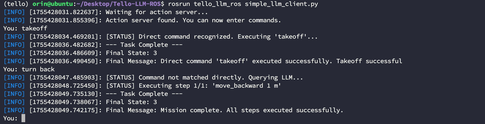

# Tello LLM ROS

This repository implements LLM control of the Tello drone within the ROS framework, accepting natural language commands as input. The current version only supports calling it through the local Ollama model. We are currently testing calling it using online models and agent systems, and will update the repository as soon as testing is complete.

Currently, we have only conducted experiments on the Nvidia Jetson Orin 64GB DK hardware. We will explore testing on a wider range of hardware devices in the future. The system and library information for the experimental environment are as follows:


Based on this, we evaluated the performance of several different local models. For test samples, see the `_define_test_cases` function in the `src/tello_llm_ros/scripts/test_llm_offline.py` script:

|Model|Accuracy|Average Response Time s|Average Generation Rate tokens/s|
|--|--|--|--|
|Qwen3:4b| | | |
|Qwen3:8b| 60.00% | 52.245 | 40.684 |
|Qwen3:14b| | | |
|CodeLlama:7b|30.00%|3.265|441.44|
|Llama3.1:8b| | | |
|DeepSeek-r1:1.7b| | | |
|DeepSeek-r1:8b| | | |

Based on our test results, most models experience errors due to frequent `takeoff` and `land` commands, indicating that local, small-parameter models still have limited understanding of long-term tasks. Although we have added preconditions to the system prompts, one option to avoid meaningless up/down calls for every command is to remove keywords. However, this may invalidate some commands that inherently carry takeoff and landing implications.

To minimize overall system response time, we implement direct calls for some explicit commands, such as `takeoff`, which are not fed into the model for inference. You can also add more direct commands by modifying the `direct_triggers` field in the `config/llm_tools.json` file as follows. The `takeoff`, `take off`, and `launch` commands can all be directly executed:

```json
{
"name": "takeoff",
"description": "Initiates the drone's automatic takeoff sequence...",
"direct_triggers": [
"takeoff",
"take off",
"launch"
],
"parameters": [],
"ros_service": "/takeoff",
"service_type": "Trigger"
},
```

----
# Step 1. Install Dependencies

## 1.1 Install Basic Dependencies
Before running, you may need to install the following dependencies, including but not limited to:

```bash
$ conda install libffi==3.3
```

## 1.2 Create a conda environment

```bash
$ conda create -n tello python=3.8
$ conda activate tello
$ pip install -r requirements.txt
```

----
# Step 2. Compile the Source Code

Enter your project and pull the source code. Here, we assume it's `tello_ws`:

```bash
$ cd tello_ws/src
$ git clone https://github.com/GaohaoZhou-ops/Tello-LLM-ROS.git
```

After pulling the code, you can compile it:

```bash
$ cd tello_ws
$ catkin_make
```

----
# Step 3. Pull the Model

You can pull the Ollama open-source model using the following command. Here, we use `Qwen3:8b` as an example:

```bash
$ ollama pull qwen3:8b
```

----
# How to Use
We provide multiple usage modes, including testing on a real device and a model, testing a model independently, and testing a model and a mock.

## Stopping Unnecessary Models

Before calling a model, to prevent resources from being preempted by an open model, you can terminate the running model using the following command:

```bash
$ ollama ps
$ ollama stop codellama:7b
```


## Modifying System Prompts

It is well known that system prompts significantly impact model performance. Although the system prompts in the project have been carefully refined, they may not be suitable for your task. If you find that the model's performance is unsatisfactory, you can modify the system prompts to constrain the model. Modify the `create_system_prompt` function in the file `scripts/llm_utils.py`:

```py
def create_system_prompt(tools_config): 
""" 
Dynamically builds the system prompt using the loaded tools config. 
This function is now the single source of truth for the system prompt. 

:param tools_config: The loaded tools configuration dictionary. 
:return: The formatted system prompt string. 
""" 
prompt = """You are a simple robot command translator. Your ONLY job is to break down a user's request into a list of simple, one-line text commands for a drone, based on the tools provided.
...
```

There are several rules in the prompt words to prevent drones from taking off and landing frequently:

```python
**RULES:**
- **CRITICAL**: The final command sequence MUST be enclosed between `[START_COMMANDS]` and `[END_COMMANDS]` tags.
- Inside the tags, output ONLY the command text, with each command on a new line.
- By default, the drone is already in the air and no additional takeoff call is required, unless there is a clear takeoff instruction.
- Unless there is a clear landing instruction, the land command cannot be called.
```

## Adding Tools

We have also extracted the tool functionality and saved it to a json file. You can add tools by modifying the `config/llm_tools.json` file:

```json
"tools": [
{
"name": "takeoff",
"description": "Initiates the drone's automatic takeoff sequence...",
"direct_triggers": [
"takeoff",
"take off",
"launch"
],
"parameters": [],
"ros_service": "/takeoff",
"service_type": "Trigger"
},
// ...
]
```

## Testing Model Performance

Before officially starting, we strongly recommend using the provided test nodes to test the model's performance and efficiency on your current device. If the success rate is too low or the average task response time is too long, we recommend replacing the model.

```bash
$ cd tello_ws
$ source devel/setup.bash
$ roslaunch tello_llm_ros test_llm.launch
```


## Local Model + Simulation Testing

After confirming the model to use, you can first run it in mock mode to test whether the current model performs as expected, as the test cases cover a small number of samples.

* Enable simulation by modifying the `use_sim` field in the `launch/tello.launch` file to `true`:

```xml
<arg name="use_sim" default="true" doc="Set to true to run in simulation mode"/>
```

* Modify In the `launch/llm_interface.launch` file, the `ollama_model` field specifies the model you want to run:

```xml
<arg name="ollama_model" default="qwen3:4b" doc="The Ollama model to use"/>
```

Open a terminal and run the simulator:
```bash
$ cd tello_ws
$ source devel/setup.bash
$ roslaunch tello_llm_ros tello.launch
```


Open a new terminal and run the model interactive window. Exit the node by typing `quit`:
```bash
$ cd tello_ws
$ source devel/setup.bash
$ roslaunch tello_llm_ros llm_interface.launch
```



## Local Model + Real Device Testing

If your model performs as expected, you can now test it on a real device:

* Modify the `use_sim` field in the `launch/tello.launch` file to `false` to enable the real device:

```xml
<arg name="use_sim" default="true" doc="Set to true to run in simulation mode"/>
```

* Modify the `ollama_model` field in the `launch/llm_interface.launch` file to the model you want to run:

```xml
<arg name="ollama_model" default="qwen3:4b" doc="The Ollama model to use"/>
```

Open a terminal to run the real device:
```bash
$ cd tello_ws
$ source devel/setup.bash
$ roslaunch tello_llm_ros tello.launch
```

Open a new terminal to run the model interactive window:
```bash
$ cd tello_ws
$ source devel/setup.bash
$ roslaunch tello_llm_ros llm_interface.launch
```
